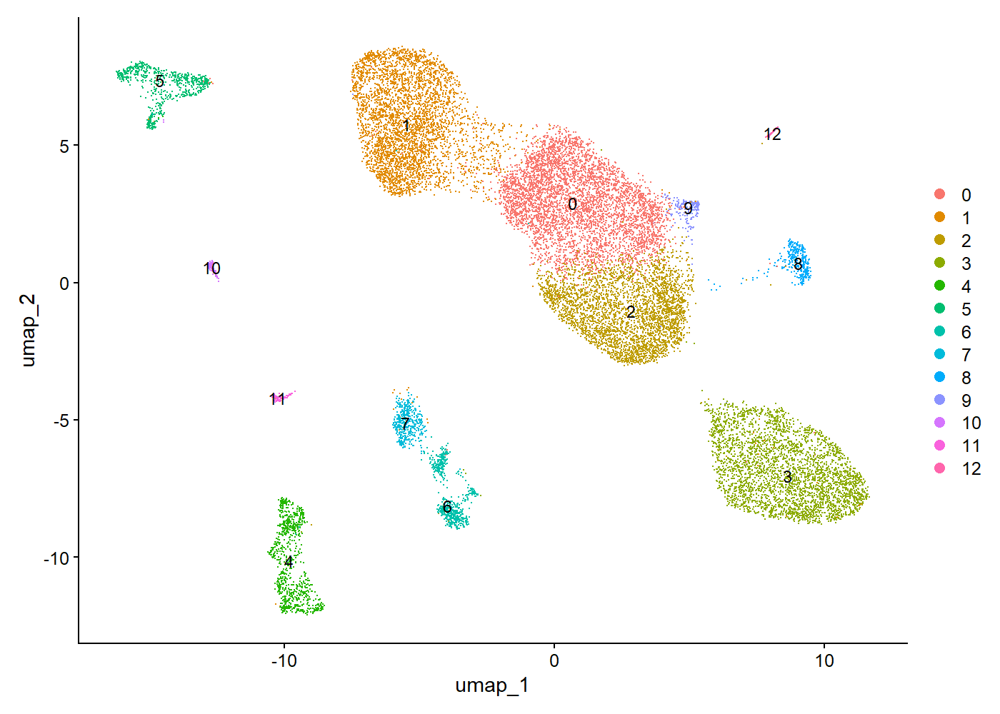

# Human Kidney Single-Cell RNA-seq – Injury and Cellular Heterogeneity Analysis



This project explores cellular heterogeneity and injury-related transcriptional programs in human kidney tissue using single-cell RNA sequencing data from **GSE131685**.

The objective was to build a structured and reproducible Seurat v5 pipeline, focusing on biologically meaningful clustering and marker gene identification within a clinically relevant nephrology context.

---

## Clinical Context

Kidney disease is characterized by complex interactions between epithelial, immune, and stromal cell populations.

Understanding these interactions at the single-cell level is critical for:

- identifying early injury signatures
- detecting cell-type-specific vulnerability
- understanding inflammatory infiltration
- exploring mechanisms of disease progression

This analysis focuses on tubular function, immune infiltration, and cellular stress responses, all central to kidney injury.

---

## Dataset

- **Source:** Gene Expression Omnibus (GEO)
- **Accession:** GSE131685
- **Data type:** Single-cell RNA sequencing
- **Framework:** Seurat v5 (R)

---

## Analytical Workflow

The analysis was performed using a reproducible stepwise pipeline:

1. Download GEO supplementary files
2. Construct Seurat objects from raw count matrices
3. Merge samples into a unified dataset
4. Perform quality control filtering
5. Normalize expression data
6. Identify variable features
7. Run PCA
8. Perform graph-based clustering
9. Generate UMAP visualizations
10. Identify cluster-specific marker genes
11. Perform preliminary biological annotation

---

## Quality Control Strategy

Cells were filtered using:

- **nFeature_RNA ≥ 200**
- **nFeature_RNA ≤ 6000**
- **percent.mt ≤ 15**

This removed low-quality cells, empty droplets, and high-mitochondrial profiles associated with stressed or dying cells.

---

## Key Results

### 1. Clustering

A total of **13 transcriptionally distinct clusters** were identified at resolution **0.4**, reflecting substantial cellular heterogeneity.

### 2. Dimensionality Reduction

Dimensionality reduction was successfully performed using:

- **PCA**
- **UMAP**

Available outputs include:

- `results/figures/elbowplot_pca.png`
- `results/figures/pca_by_sample.png`
- `results/figures/umap_by_cluster_res_0_4.png`
- `results/figures/umap_by_sample_res_0_4.png`

### 3. Marker Gene Analysis

Marker detection was performed using `FindAllMarkers()` after joining assay layers in Seurat v5.

A total of **5,324 marker genes** were identified across clusters, and a top-marker summary was generated for all 13 clusters.

### 4. Preliminary Biological Interpretation

Cluster-level marker analysis suggested the presence of:

- **Proximal tubular populations** with markers such as `FABP1`, `S100A1`, and `GPX3`
- **Distal tubular populations** with markers including `PVALB` and `DUSP9`
- **Collecting duct signatures** with `AQP2` and `CLDN8`
- **T / NK-like immune populations** marked by `TRDC`, `GZMA`, and `CTSW`
- **B-cell populations** marked by `CD79A`, `MS4A1`, and `IGHM`
- **Monocyte / macrophage-like populations** with `CSF1R`, `FPR1`, and `S100A12`
- **Stress/injury-related transcriptional programs** including `GSTP1`, `SOD2`, and `APP`

These findings support a mixed renal epithelial and immune landscape with evidence of injury-related transcriptional heterogeneity.

---

## Technical Note

A Seurat v5-specific issue was encountered during differential expression analysis:

- `FindAllMarkers()` initially returned no markers
- the warning indicated that assay layers were not joined
- this was resolved using:

```r
seurat_obj <- JoinLayers(seurat_obj, assay = "RNA")

human-kidney-singlecell-injury-transcriptomic-analysis/
├── results/
│   ├── figures/
│   └── tables/
├── scripts/
│   ├── 01_initialize_seurat_gse131685.R
│   ├── 02_qc_filtering_gse131685.R
│   ├── 03_normalize_pca_gse131685.R
│   ├── 04_clustering_umap_gse131685.R
│   ├── 05_marker_genes_annotation.R
│   └── 06_cluster_annotation_summary.R
├── .gitignore
└── README.md


Main Outputs

Figures:

QC violin plots
QC scatter plots
PCA visualization
UMAP visualization

Tables:

QC summaries
PCA embeddings
UMAP embeddings
cluster sizes
marker gene tables
top-marker summaries
cluster annotation summary


Limitations:

Cell type annotation remains preliminary
No external validation dataset was included
No trajectory or pseudotime analysis was performed
Clinical metadata integration remains limited

Future Directions:

Refined renal cell-type annotation using curated references
Trajectory analysis for injury and repair states
Integration with clinical metadata
Comparative analysis across disease groups

Why This Project:

This repository demonstrates:

reproducible single-cell RNA-seq analysis in R
structured Seurat v5 workflow design
real-world debugging of differential expression issues
clinically oriented interpretation in nephrology
integration of medical knowledge with computational analysis

Author

Cristian Arias, MD
Nephrologist | Healthcare Data Scientist | Bioinformatics MSc Candidate