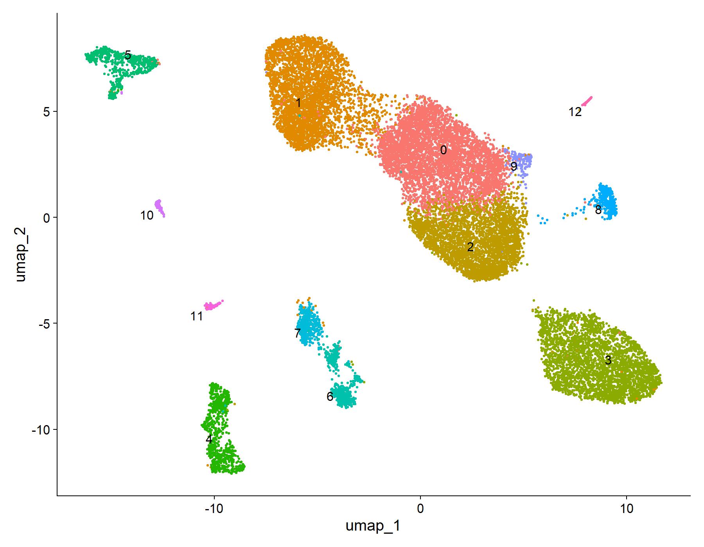

# Human Kidney Single-Cell RNA-seq – Injury and Cellular Heterogeneity Analysis



This project explores cellular heterogeneity and injury-related transcriptional programs in human kidney tissue using single-cell RNA sequencing data from **GSE131685**.

The objective was to build a structured and reproducible **Seurat v5** pipeline for quality control, dimensionality reduction, clustering, marker identification, and preliminary biological interpretation in a clinically relevant nephrology setting.

---

## Clinical Context

Kidney disease emerges from complex interactions between epithelial, immune, and stromal cell populations. Studying these compartments at single-cell resolution helps reveal:

- injury-associated transcriptional programs
- cell-type-specific vulnerability
- inflammatory infiltration
- potential mechanisms of disease progression

This analysis focuses on **renal epithelial heterogeneity**, **immune cell infiltration**, and **stress-response signatures** relevant to kidney injury.

---

## Dataset

- **Source:** Gene Expression Omnibus (GEO)
- **Accession:** GSE131685
- **Data type:** Single-cell RNA sequencing
- **Analysis framework:** Seurat v5 in R

---

## Analytical Workflow

The analysis followed a reproducible stepwise workflow:

1. Download GEO supplementary files
2. Construct Seurat objects from matrix, barcode, and feature files
3. Merge samples into a unified Seurat object
4. Perform quality control filtering
5. Normalize expression data
6. Identify variable features
7. Run PCA
8. Perform graph-based clustering
9. Generate UMAP visualizations
10. Detect cluster-specific marker genes
11. Perform preliminary biological annotation

---

## Quality Control Strategy

Cells were filtered using the following thresholds:

- **nFeature_RNA ≥ 200**
- **nFeature_RNA ≤ 6000**
- **percent.mt ≤ 15**

This reduced low-quality cells, probable empty droplets, and high-mitochondrial-content profiles associated with stressed or dying cells.

---

## Key Results

This analysis reveals a biologically meaningful structure within human kidney tissue, highlighting three major axes:

### 1. Functional epithelial heterogeneity

Distinct tubular populations were identified, including proximal, distal, and collecting duct cells.

- Proximal tubule clusters showed enrichment in metabolic genes (FABP1, GPX3), consistent with high metabolic demand.
- Distal and collecting duct clusters expressed transport-related markers (PVALB, AQP2), reflecting functional specialization.

This supports the presence of **functional compartmentalization within renal epithelium**.

---

### 2. Evidence of immune infiltration

Multiple clusters were consistent with immune populations:

- T/NK cells (TRDC, GZMA)
- B cells (CD79A, MS4A1)
- Monocyte/macrophage populations (CSF1R, FPR1)

This indicates that the dataset captures a **mixed epithelial-immune microenvironment**, which is highly relevant in kidney disease.

---

### 3. Injury and oxidative stress signatures

Several clusters showed strong enrichment of stress-related genes:

- GSTP1, SOD2 → oxidative stress response
- APP → cellular stress and injury pathways

These findings suggest the presence of **active injury-related transcriptional programs**, likely reflecting cellular stress or pathological states.

---

### Overall interpretation

The dataset reflects a **heterogeneous renal environment combining epithelial specialization, immune infiltration, and injury-related signaling**.

This pattern is consistent with early or ongoing kidney injury processes and highlights the value of single-cell transcriptomics for detecting complex tissue states.
### 1. Clustering

A total of **13 transcriptionally distinct clusters** were identified at clustering resolution **0.4**, indicating substantial cellular heterogeneity within the dataset.

### 2. Dimensionality Reduction

Dimensionality reduction was successfully performed using:

- **Principal Component Analysis (PCA)**
- **Uniform Manifold Approximation and Projection (UMAP)**

Generated outputs include:

- `results/figures/elbowplot_pca.png`
- `results/figures/pca_by_sample.png`
- `results/figures/umap_by_cluster_res_0_4.png`
- `results/figures/umap_by_sample_res_0_4.png`

### 3. Marker Gene Analysis

Marker detection was performed using `FindAllMarkers()` after resolving a Seurat v5 layer issue.

A total of **5,324 marker genes** were identified across clusters, with top-marker summaries generated for all 13 clusters.

---

## Technical Note: Seurat v5 Layer Issue

During differential expression analysis, `FindAllMarkers()` initially returned no genes because assay layers were not joined.

This was corrected using:

```r
seurat_obj <- JoinLayers(seurat_obj, assay = "RNA")

```
=======
## Biological Interpretation

Cluster-level marker analysis revealed a complex renal microenvironment composed of epithelial, immune, and stress-responsive populations.

Rather than representing isolated cell types, the data suggests a **dynamic system where epithelial cells coexist with immune infiltration and injury-related transcriptional activity**.

Key observations:

- Tubular epithelial cells show clear metabolic and transport specialization.
- Immune populations indicate active surveillance or inflammatory processes.
- Stress-related gene expression suggests oxidative or injury-driven cellular states.

This integrated view aligns with known mechanisms of kidney disease, where epithelial dysfunction, inflammation, and cellular stress interact to drive pathology..

Repository Structure :

human-kidney-singlecell-injury-transcriptomic-analysis/
├── results/
│   ├── figures/
│   └── tables/
├── scripts/
│   ├── 01_initialize_seurat_gse131685.R
│   ├── 02_qc_filtering_gse131685.R
│   ├── 03_normalize_pca_gse131685.R
│   ├── 04_clustering_umap_gse131685.R
│   ├── 05_marker_genes_annotation.R
│   └── 06_cluster_annotation_summary.R
├── .gitignore
└── README.md

Main Outputs :

Figures: 

QC violin plots
QC scatter plots
PCA visualization
UMAP visualization

Tables:

QC summaries
PCA embeddings
UMAP embeddings
cluster sizes
marker gene tables
top-marker summaries
cluster annotation summary

Limitations:

Cell type annotation remains preliminary
No external validation dataset was included
No trajectory or pseudotime analysis was performed
Clinical metadata integration remains limited

Future Directions:

Refined renal cell-type annotation using curated references
Trajectory analysis for injury and repair states
Integration with clinical metadata
Comparative analysis across disease subgroups

Why This Project: 

## Clinical Relevance

This analysis provides a framework to explore how different cellular compartments contribute to kidney injury.

The coexistence of epithelial specialization, immune infiltration, and stress signaling suggests that:

- injury is not limited to a single cell type
- multiple biological processes occur simultaneously
- early transcriptional changes may precede structural damage

This reinforces the importance of multi-cellular analysis in understanding kidney disease progression.
This repository demonstrates:

reproducible single-cell RNA-seq analysis in R
structured Seurat v5 workflow design
real-world debugging of differential expression issues
clinically oriented interpretation in nephrology
integration of medical knowledge with computational analysis

Author

Cristian Arias, MD
Nephrologist | Healthcare Data Scientist | Bioinformatics MSc Candidate
