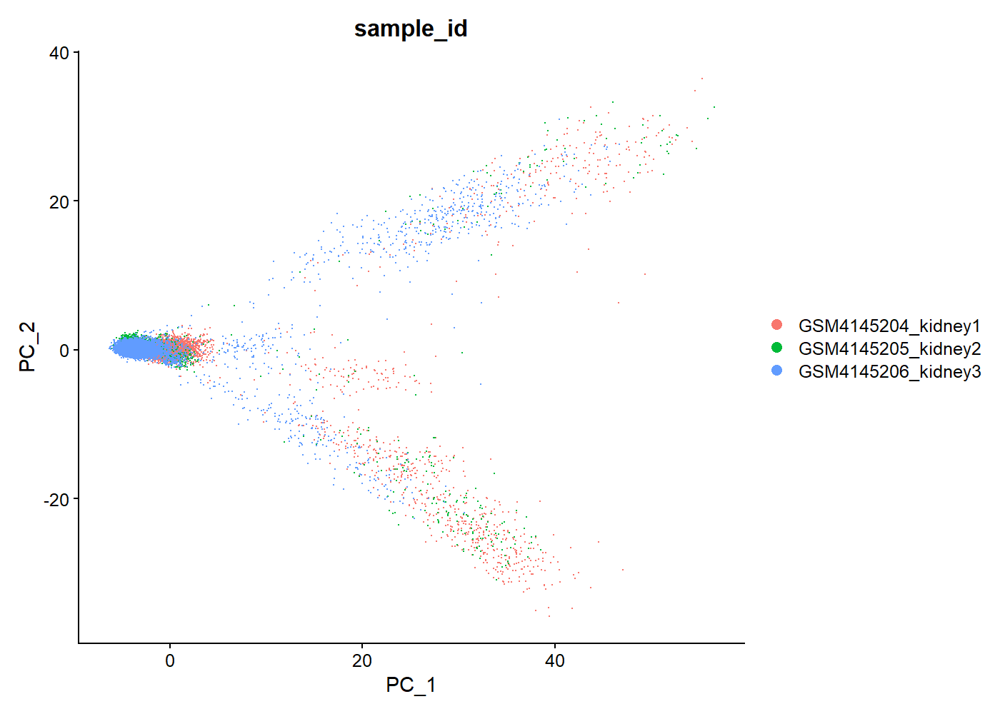

# Human Kidney Single-Cell RNA-seq – Injury and Cellular Heterogeneity Analysis

## Cell Type Annotation

<p align="center">
  
</p>

---

## Overview

This project explores cellular heterogeneity and injury-related transcriptional programs in human kidney tissue using single-cell RNA sequencing data (**GSE131685**).

A structured and reproducible **Seurat v5 pipeline** was implemented to perform quality control, dimensionality reduction, clustering, marker identification, and biologically informed cell type annotation within a clinically relevant nephrology framework.

---

## Clinical Context

Kidney disease arises from complex interactions between epithelial, immune, and stromal cell populations.

Single-cell transcriptomics enables:

- resolution of nephron segment specialization
- identification of injury-associated transcriptional programs
- detection of immune infiltration
- characterization of cellular stress responses

This analysis focuses on **renal epithelial heterogeneity**, **immune cell populations**, and **injury-related transcriptional states**.

---

## Dataset

- Source: Gene Expression Omnibus (GEO)
- Accession: GSE131685
- Data type: Single-cell RNA sequencing
- Framework: Seurat v5 (R)

---

## Analytical Workflow

1. Data acquisition from GEO
2. Seurat object construction
3. Quality control filtering
4. Normalization and feature selection
5. PCA and dimensionality reduction
6. Graph-based clustering
7. UMAP visualization
8. Marker gene identification
9. Biologically informed cell type annotation

---

## Quality Control

Filtering thresholds:

- **nFeature_RNA ≥ 200**
- **nFeature_RNA ≤ 6000**
- **percent.mt ≤ 15**

These criteria remove low-quality cells, probable empty droplets, and high-mitochondrial profiles associated with stressed or dying cells.

---

## Key Biological Findings

The analysis identifies a renal cellular ecosystem dominated by tubular specialization, inflammatory infiltration, and injury-associated transcriptional states, supporting a multicellular model of kidney injury rather than a purely compartment-specific process.

### 1. Tubular epithelial heterogeneity

Multiple nephron segments were identified:

- **Proximal tubule** (FABP1, metabolic profile)
- **Distal tubule** (PVALB)
- **Collecting duct** (AQP2, CLDN8)

This reflects clear **functional compartmentalization within the renal epithelium**.

---

### 2. Immune cell infiltration

Distinct immune populations were detected:

- **Cytotoxic T/NK cells** (TRDC, GZMA)
- **B cells** (CD79A, MS4A1)
- **Myeloid cells** (CSF1R, FPR1)

This supports the presence of an **active inflammatory microenvironment**.

---

### 3. Injury and stress-related states

Several clusters showed enrichment of:

- **Oxidative stress markers** (GSTP1, SOD2)
- **Injury-associated genes** (APP)
- **Mitochondrial stress signatures**

These findings indicate **active injury-related transcriptional programs**, consistent with early or ongoing kidney damage.

---

## Additional QC and Dimensionality Reduction

<p align="center">
  
</p>

The PCA projection supports the presence of transcriptomic heterogeneity across kidney cell populations and complements the UMAP-based cell type annotation.

---

## Final Cell Type Summary

| Cluster | Final Annotation                | Confidence |
|--------:|---------------------------------|------------|
| 0       | Proximal Tubule                | High       |
| 1       | Proximal Tubule (stressed)     | High       |
| 2       | Proximal Tubule (metabolic)    | Medium     |
| 3       | Injury / Stress                | Medium     |
| 4       | T/NK cells                     | High       |
| 5       | Myeloid                        | High       |
| 6       | Stress / Transitional          | Low        |
| 7       | Transitional / Unknown         | Low        |
| 8       | Distal Tubule                  | High       |
| 9       | Injury / Dedifferentiated      | Medium     |
| 10      | B cells                        | High       |
| 11      | Collecting Duct (Principal)    | High       |
| 12      | Collecting Duct (Intercalated) | High       |

---

## Technical Highlights

- Seurat v5 pipeline implementation
- Resolution of `FindAllMarkers()` compatibility issue using `JoinLayers()`
- Cluster-level marker identification and filtering
- Manual biologically informed curation of cluster identities based on canonical renal and immune markers

---

## Repository Structure

```text
human-kidney-singlecell-injury-transcriptomic-analysis/
├── data/
│   └── processed/
├── results/
│   ├── figures/
│   └── tables/
├── scripts/
│   ├── 01_initialize_seurat_gse131685.R
│   ├── 02_qc_filtering_gse131685.R
│   ├── 03_normalize_pca_gse131685.R
│   ├── 04_clustering_umap_gse131685.R
│   ├── 05_marker_genes_annotation.R
│   └── 06_cluster_annotation_summary.R
└── README.md

## Reproducibility

Environment

This project was developed in R using Seurat v5 for single-cell RNA-seq analysis.

Main packages used:

Seurat
dplyr
ggplot2
patchwork

## Execution Order :

source("scripts/01_initialize_seurat_gse131685.R")
source("scripts/02_qc_filtering_gse131685.R")
source("scripts/03_normalize_pca_gse131685.R")
source("scripts/04_clustering_umap_gse131685.R")
source("scripts/05_marker_genes_annotation.R")
source("scripts/06_cluster_annotation_summary.R")

## Main outputs :

-annotated UMAP: results/figures/umap_celltype_annotation.png
-PCA by sample: results/figures/pca_by_sample.png
-publication-ready UMAP: results/figures/umap_publication_ready.png
-cluster annotation summary: `results/tables/cluster_annotation_summary.csv`
-marker table: results/tables/all_markers.csv

## Limitations : 

cell type annotation was performed through cluster-level marker interpretation and biologically informed manual curation
external reference-based annotation was not included in this version
no trajectory or pseudotime analysis
no integration with clinical metadata

## Future Directions :

reference-based annotation (Azimuth / CellTypist)
trajectory analysis of injury-repair processes
integration with clinical or disease-stage metadata

## Clinical Relevance :

This analysis demonstrates that kidney injury is not restricted to a single compartment but involves:

epithelial dysfunction
immune activation
stress-response signaling

These processes occur simultaneously, supporting a multicellular model of kidney disease progression.

Author

Cristian Arias, MD
Nephrologist | Healthcare Data Scientist | Bioinformatics MSc Candidate