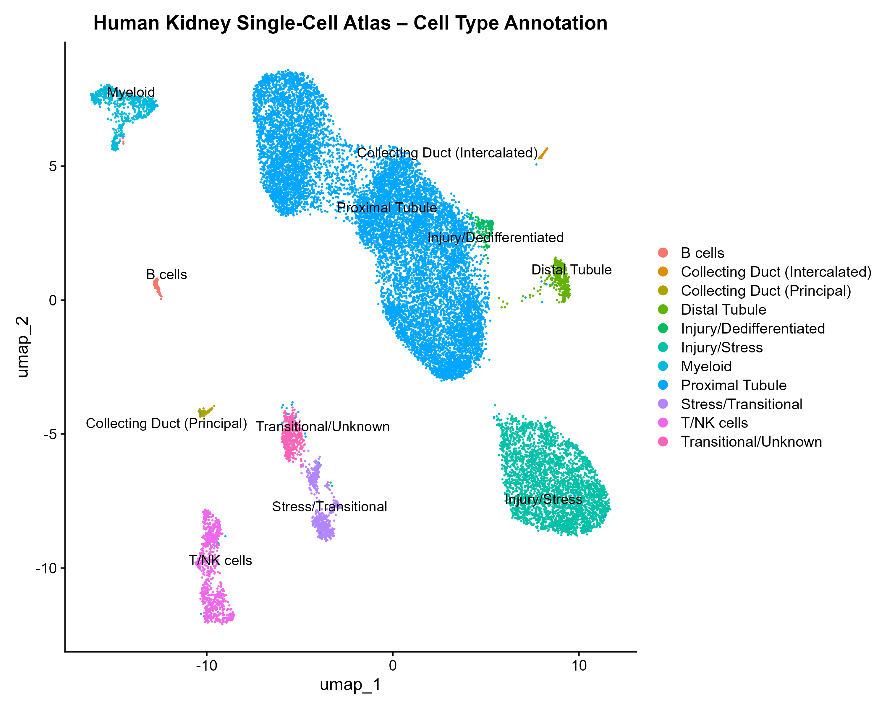

# Human Kidney Single-Cell RNA-seq – Injury and Cellular Heterogeneity Analysis

## Cell Type Annotation

---

## Overview

This project explores cellular heterogeneity and injury-related transcriptional programs in human kidney tissue using single-cell RNA sequencing data (**GSE131685**).

A structured and reproducible **Seurat v5 pipeline** was implemented to perform quality control, dimensionality reduction, clustering, marker identification, and biologically meaningful cell type annotation in a clinically relevant nephrology context.

---

## Clinical Context

Kidney disease arises from complex interactions between epithelial, immune, and stromal cell populations.

Single-cell transcriptomics allows:

- resolution of nephron segment specialization
- identification of injury-associated transcriptional programs
- detection of immune infiltration
- characterization of cellular stress responses

This analysis focuses on **epithelial heterogeneity**, **immune components**, and **injury-related states** within renal tissue.

---

## Dataset

- Source: GEO
- Accession: GSE131685
- Data type: single-cell RNA-seq
- Framework: Seurat v5 (R)

---

## Analytical Workflow

1. Data acquisition from GEO
2. Seurat object construction
3. Quality control filtering
4. Normalization and feature selection
5. PCA and dimensionality reduction
6. Graph-based clustering
7. UMAP visualization
8. Marker gene identification
9. Cell type annotation based on biological interpretation

---

## Quality Control

Filtering thresholds:

- nFeature_RNA ≥ 200
- nFeature_RNA ≤ 6000
- percent.mt ≤ 15

These criteria removed low-quality cells and high-mitochondrial profiles associated with cellular stress or death.

---

## Key Biological Findings

This analysis reveals a heterogeneous renal microenvironment combining epithelial specialization, immune infiltration, and injury-related transcriptional programs.

### 1. Tubular epithelial heterogeneity

Multiple nephron segments were identified:

- **Proximal tubule** (FABP1, metabolic profile)
- **Distal tubule** (PVALB)
- **Collecting duct** (AQP2, CLDN8)

This reflects clear **functional compartmentalization** within the renal epithelium.

---

### 2. Immune cell infiltration

Distinct immune populations were detected:

- **Cytotoxic T/NK cells** (TRDC, GZMA)
- **B cells** (CD79A, MS4A1)
- **Myeloid cells** (CSF1R, FPR1)

This supports the presence of an **active inflammatory microenvironment**.

---

### 3. Injury and stress-related states

Several clusters showed enrichment of:

- **Oxidative stress markers** (GSTP1, SOD2)
- **Injury-associated genes** (APP)
- **Mitochondrial stress signatures**

These findings indicate **active injury-related transcriptional programs**, consistent with early or ongoing kidney damage.

---

## Technical Highlights

- Seurat v5 pipeline implementation
- Resolution of `FindAllMarkers()` issue using `JoinLayers()`
- Cluster-level marker extraction and interpretation
- Manual biologically informed cell type annotation

---

## Repository Structure

human-kidney-singlecell-injury-transcriptomic-analysis/
├── results/
│ ├── figures/
│ └── tables/
├── scripts/
│ ├── 01_initialize_seurat_gse131685.R
│ ├── 02_qc_filtering_gse131685.R
│ ├── 03_normalize_pca_gse131685.R
│ ├── 04_clustering_umap_gse131685.R
│ ├── 05_marker_genes_annotation.R
│ └── 06_cluster_annotation_summary.R
└── README.md

---

## Limitations

- Cell type annotation is based on marker interpretation and not external reference mapping
- No trajectory or pseudotime analysis
- No integration with clinical metadata

---

## Future Directions

- Reference-based annotation (Azimuth / CellTypist)
- Trajectory analysis of injury-repair processes
- Integration with clinical or disease-stage metadata

---

## Clinical Relevance

This analysis demonstrates that kidney injury is not restricted to a single compartment but involves:

- epithelial dysfunction
- immune activation
- stress-response signaling

These processes occur simultaneously, supporting a **multi-cellular model of kidney disease progression**.

---

## Author

Cristian Arias, MD  
Nephrologist | Healthcare Data Scientist | Bioinformatics MSc Candidate
